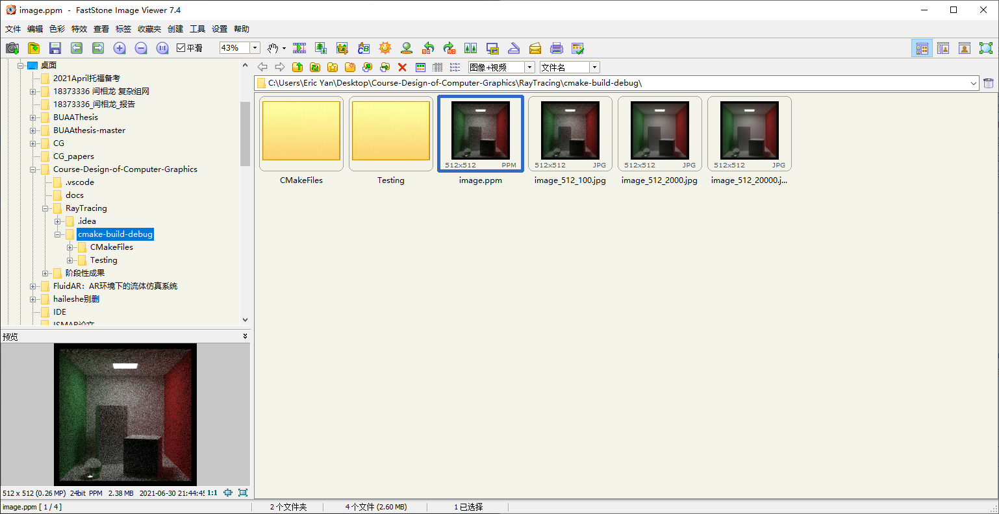

# Course-Design-of-Computer-Graphics
### 运行方式

如果使用window环境，则打开cmd，依此输入前两条命令，进入到“Course-Design-of-Computer-Graphics\RayTracing\cmake-build-debug”这一目录。随后使用cmd运行RayTracing.exe，并重定向进image.ppm文件中。

cd RayTracing

cd cmake-build-debug

RayTracing.exe > image.ppm

### 查看方式

为了查看ppm格式的图片，请下载“FastStone Image Viewer”。软件下载地址如下：

https://www.faststone.org/FSIVDownload.htm

下载FastStone Image Viewer 7.5的exe，安装后，用FastStone Image Viewer打开Course-Design-of-Computer-Graphics\RayTracing\cmake-build-debug目录即可查看ppm文件。由于ppm格式没有经过任何压缩，图片体积较大，因此使用软件现实可能略有延迟。使用截图如下：

